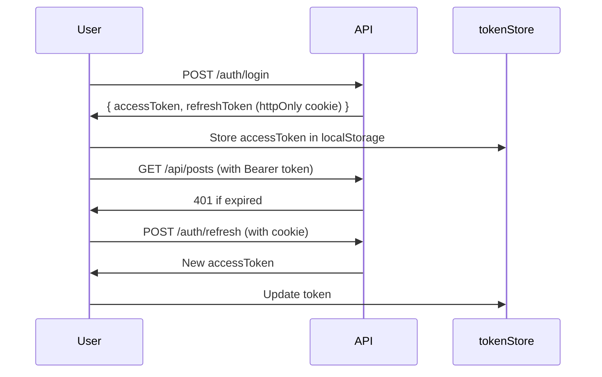
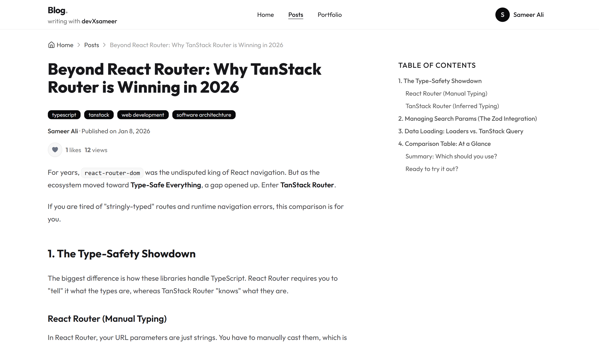
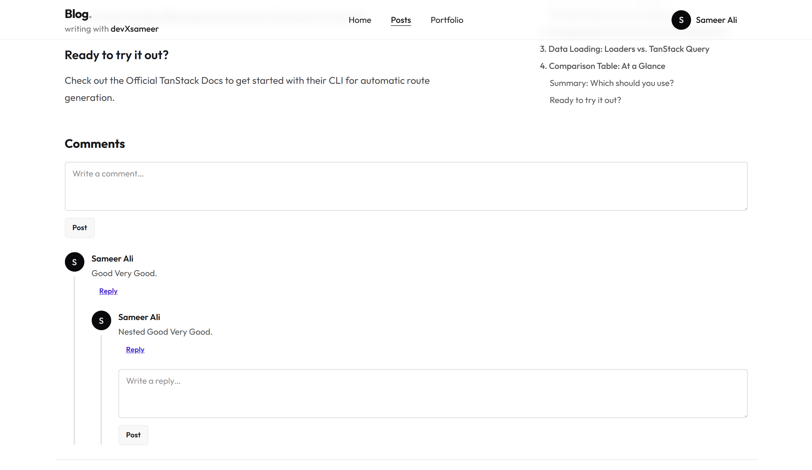
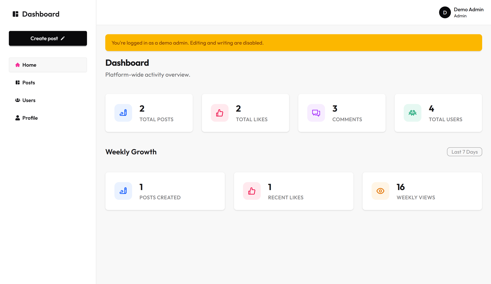
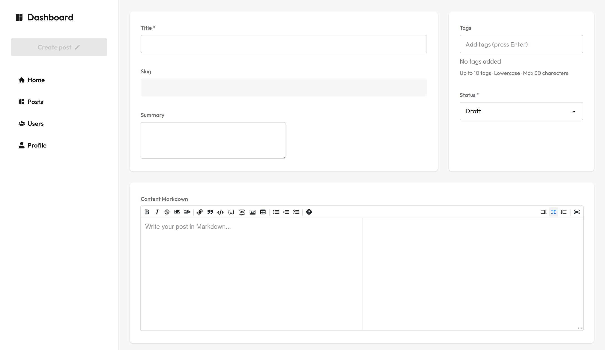

# 📝 Modern Blog Platform

A **production-grade full-stack blog platform** built with modern React patterns, featuring a public-facing blog and a role-based admin dashboard. Built as a real-world portfolio project demonstrating scalable frontend architecture, type-safe API patterns, and professional authentication flows.

[](https://react.dev/)
[](https://www.typescriptlang.org/)
[](https://tanstack.com/router)
[](https://tanstack.com/query)
[](https://pnpm.io/)

---

## 🌐 Live Demo

- **Public Blog**: [blog.devxsameer.me](https://blog.devxsameer.me)
- **Admin Dashboard**: [dashboard.blog.devxsameer.me](https://dashboard.blog.devxsameer.me)

---

## ✨ Key Features

### 🌍 Public Blog ([`apps/web`](apps/web))

- **📖 Post Browsing** – Infinite scroll with cursor-based pagination
- **💬 Nested Comments** – Tree-structured comment system with reply threading
- **❤️ Social Interactions** – Like/unlike posts with optimistic updates
- **📑 Dynamic Table of Contents** – Auto-generated from markdown headings
- **🔐 Authentication** – JWT-based login/signup with refresh tokens
- **👤 User Profiles** – Bio editing and avatar uploads via Cloudinary

### 🎛️ Admin Dashboard ([`apps/dashboard`](apps/dashboard))

- **📝 Post Management** – Create, edit, and delete posts with markdown editor
- **📊 Analytics Dashboard** – Post views, likes, and engagement metrics
- **👥 User Management** – Admin-only user list with role/status filtering
- **🏷️ Tag System** – Organize posts with reusable tags
- **🔒 Role-Based Access** – Admin and Author roles with different permissions
- **🖼️ Asset Uploads** – Avatar management with Cloudinary integration

### 📦 Shared Packages ([`packages/*`](packages))

- **`@blog/api-client`** – Type-safe API client with auth handling
- **`@blog/types`** – Shared TypeScript types across apps
- **`@blog/token-store`** – Secure JWT token management
- **`@blog/tsconfig`** – Shared TypeScript configurations

---

## 🎯 Why This Project Exists

This isn't a tutorial clone—it's a **real production-style application** built to demonstrate professional frontend engineering skills:

✅ **Type-safe data fetching** with TanStack Query mutations and loaders  
✅ **File-based routing** with TanStack Router and automatic code splitting  
✅ **Optimistic UI updates** for instant user feedback  
✅ **Secure authentication** with JWT + refresh token rotation  
✅ **Monorepo architecture** with shared domain logic  
✅ **Clean separation of concerns** (features, layouts, routes)  
✅ **Production error handling** with user-friendly fallbacks

Built to showcase skills needed for **real engineering teams**, not just side projects.

---

## 🧱 Tech Stack

### Frontend

| Technology                 | Purpose                                         |
| -------------------------- | ----------------------------------------------- |
| **React 19**               | UI library with latest features                 |
| **TanStack Router**        | Type-safe file-based routing with loaders       |
| **TanStack Query v5**      | Server state management with optimistic updates |
| **TypeScript**             | Strict type safety across the monorepo          |
| **Tailwind CSS + DaisyUI** | Utility-first styling with component library    |
| **Vite**                   | Lightning-fast dev server and build tool        |
| **Markdown Rendering**     | `react-markdown` with syntax highlighting       |

### Backend (Separate Repository)

| Technology            | Purpose                          |
| --------------------- | -------------------------------- |
| **Node.js + Express** | REST API server                  |
| **Drizzle ORM**       | Type-safe SQL query builder      |
| **PostgreSQL**        | Relational database              |
| **Zod**               | Runtime validation               |
| **JWT**               | Stateless authentication         |
| **Cloudinary**        | Image hosting and transformation |

---

## 🗂️ Project Structure

```
blog-platform/
├── apps/
│   ├── web/                    # Public blog (React + TanStack)
│   │   ├── src/
│   │   │   ├── app/            # App providers and router config
│   │   │   ├── features/       # Feature-based modules
│   │   │   │   ├── auth/       # Login, signup, auth queries
│   │   │   │   ├── post/       # Post list, detail, queries
│   │   │   │   ├── comment/    # Comment tree, mutations
│   │   │   │   └── profile/    # User profile editing
│   │   │   ├── layouts/        # Header, Footer, AuthLayout
│   │   │   ├── routes/         # File-based route definitions
│   │   │   ├── shared/         # Reusable components/utils
│   │   │   └── main.tsx        # App entry point
│   │   └── vite.config.ts
│   │
│   └── dashboard/              # Admin dashboard (React + TanStack)
│       ├── src/
│       │   ├── app/            # Query client and router setup
│       │   ├── features/       # Admin-specific features
│       │   │   ├── dashboard/  # Analytics overview
│       │   │   ├── posts/      # Post CRUD with markdown editor
│       │   │   ├── users/      # User management (admin only)
│       │   │   └── profile/    # Profile + avatar upload
│       │   ├── layouts/        # Dashboard layout with sidebar
│       │   ├── routes/         # Protected admin routes
│       │   └── main.tsx
│       └── vite.config.ts
│
├── packages/
│   ├── api-client/             # Shared API client
│   │   ├── src/
│   │   │   ├── endpoints/      # API methods (posts, auth, etc.)
│   │   │   ├── http/           # Auth-aware fetch wrapper
│   │   │   └── unwrap.ts       # Response unwrapping utilities
│   │   └── package.json
│   │
│   ├── types/                  # Shared TypeScript types
│   │   └── src/
│   │       ├── auth.ts
│   │       ├── post.ts
│   │       ├── comment.ts
│   │       └── dashboard.ts
│   │
│   ├── token-store/            # JWT storage abstraction
│   └── tsconfig/               # Shared TS configs
│
├── pnpm-workspace.yaml         # Monorepo workspace config
├── package.json                # Root workspace scripts
└── README.md
```

---

## 🔐 Authentication Architecture

### Token Flow



### Key Design Decisions

- **Access tokens** stored in `localStorage` for client-side access
- **Refresh tokens** in `httpOnly` cookies (XSS protection)
- **Automatic token refresh** via TanStack Query error handling
- **Optimistic logout** clears tokens immediately, server call is optional

**Implementation:** See [`packages/api-client/src/http/auth-http.ts`](packages/api-client/src/http/auth-http.ts)

---

## 🔄 Data Fetching Patterns

### TanStack Query + Router Integration

#### 1. **Route Loaders** (Server-State Prefetching)

```tsx
// apps/dashboard/src/routes/dashboard/index.tsx
export const Route = createFileRoute('/dashboard/')({
  loader: async ({ context }) => {
    if (context.user?.role === 'admin') {
      return {
        role: 'admin',
        overview: await dashboardApi.adminOverview(),
      };
    }
    // ...
  },
  component: DashboardPage,
});
```

#### 2. **Infinite Queries** (Pagination)

```tsx
// apps/web/src/features/post/queries/posts.query.ts
export function useInfinitePosts() {
  return useInfiniteQuery({
    queryKey: ['posts'],
    queryFn: ({ pageParam }) => postsApi.list({ cursor: pageParam }),
    getNextPageParam: (lastPage) => lastPage.meta?.nextCursor,
  });
}
```

#### 3. **Optimistic Updates** (Instant UI Feedback)

```tsx
// apps/web/src/features/profile/mutations/update-profile.mutation.ts
return useMutation({
  mutationFn: (input) => usersApi.updateMe(input),
  onMutate: async (input) => {
    await queryClient.cancelQueries({ queryKey: ['me'] });
    const previous = queryClient.getQueryData<User>(['me']);

    // Optimistically update cache
    queryClient.setQueryData<User>(['me'], (old) =>
      old ? { ...old, ...input } : old,
    );

    return { previous };
  },
  onError: (err, vars, context) => {
    // Rollback on error
    queryClient.setQueryData(['me'], context?.previous);
  },
});
```

---

## 🧠 Key Architectural Decisions

### 1. **Monorepo Over Multi-Repo**

**Why?** Share types, API client, and domain logic between web and dashboard without duplication.

**Tradeoff:** Increased initial setup complexity vs. long-term maintainability.

### 2. **Feature-Based Folder Structure**

```
features/
├── auth/
│   ├── pages/          # SignupPage, LoginPage
│   ├── auth.api.ts     # Login/logout functions
│   └── auth.query.ts   # useAuthQuery hook
├── post/
│   ├── components/     # PostCard, PostContent
│   ├── queries/        # useInfinitePosts
│   └── pages/          # PostPage, PostsPage
```

**Why?** Each feature is self-contained—easier to navigate, test, and refactor.

### 3. **Route-Level Auth Guards**

```tsx
// apps/dashboard/src/routes/dashboard/route.tsx
export const Route = createFileRoute('/dashboard')({
  beforeLoad: ({ context }) => {
    if (!context.user || !['admin', 'author'].includes(context.user.role)) {
      throw redirect({ to: '/login' });
    }
  },
  component: DashboardLayout,
});
```

**Why?** Keeps auth logic out of components—routes are protected at load time.

### 4. **Shared API Client Package**

**Why?**

- Type-safe API calls with shared error handling
- Single source of truth for API endpoints
- Automatic auth token injection via [`auth-http.ts`](packages/api-client/src/http/auth-http.ts)

**Example:**

```ts
// packages/api-client/src/endpoints/posts.ts
export const postsApi = {
  async list(params?: { cursor?: string; limit?: number }) {
    const { status, body } = await authHttp('/api/posts', { params });
    return unwrapWithMeta<{ data: Post[]; meta: Pagination }>(status, body);
  },
};
```

---

## 🧪 Error Handling

### Validation Errors (400)

```tsx
// apps/web/src/features/auth/pages/SignupPage.tsx
onError: (err) => {
  if (err instanceof ValidationError) {
    setIssues(err.issues); // Show field-level errors
  } else if (err instanceof ApiClientError) {
    setError(err.message);
  }
};
```

### Auth Errors (401)

Handled automatically in [`auth-http.ts`](packages/api-client/src/http/auth-http.ts) with token refresh retry logic.

### Route Errors

```tsx
// apps/dashboard/src/app/router.tsx
defaultErrorComponent: ({ error }) => (
  <div className="p-6">
    <h2 className="text-xl font-bold">Something went wrong</h2>
    <pre className="text-sm opacity-70">{error.message}</pre>
  </div>
),
```

---

## 🖼️ Avatar Upload Flow

1. **Request signed upload URL** from backend
2. **Upload directly to Cloudinary** (keeps server out of file handling)
3. **Save Cloudinary URL** to user profile in database

**Implementation:** [`apps/dashboard/src/features/profile/components/AvatarUploader.tsx`](apps/dashboard/src/features/profile/components/AvatarUploader.tsx)

---

## 🚀 Running Locally

### Prerequisites

- **Node.js** >= 18
- **pnpm** >= 8
- **PostgreSQL** database running
- Backend API running on `http://localhost:6969`

### Setup

```bash
# Clone the repository
git clone https://github.com/devxsameer/blog-platform
cd blog-platform

# Install dependencies
pnpm install

# Start development servers (both apps + watch mode for packages)
pnpm dev

# Or run individually:
pnpm --filter web dev        # Public blog on http://localhost:5173
pnpm --filter dashboard dev  # Dashboard on http://localhost:5174
```

### Build for Production

```bash
pnpm build
```

---

## 📸 Screenshots

### Public Blog




### Admin Dashboard




---

## 🛠️ Available Scripts

| Command                       | Description                        |
| ----------------------------- | ---------------------------------- |
| `pnpm dev`                    | Start all apps in development mode |
| `pnpm build`                  | Build all apps for production      |
| `pnpm --filter web dev`       | Run only the public blog           |
| `pnpm --filter dashboard dev` | Run only the admin dashboard       |
| `pnpm typecheck`              | Run TypeScript compiler check      |
| `pnpm lint`                   | Lint all packages                  |

---

## 📚 Learning Resources

This project demonstrates patterns from:

- [TanStack Router Documentation](https://tanstack.com/router/latest)
- [TanStack Query Best Practices](https://tanstack.com/query/latest/docs/react/guides/optimistic-updates)
- [React 19 Features](https://react.dev/blog/2024/12/05/react-19)
- [TypeScript Handbook](https://www.typescriptlang.org/docs/)

---

## 🤝 Future Improvements

- [ ] Add full-text search with filters
- [ ] Implement post drafts auto-save
- [ ] Add email notifications for comment replies
- [ ] Support for multiple authors per post
- [ ] Dark mode support
- [ ] E2E tests with Playwright
- [ ] Storybook for component documentation

---

## 👤 Author

**Sameer**  
Portfolio: [devxsameer.me](https://devxsameer.me)  
GitHub: [@devxsameer](https://github.com/devxsameer)  
LinkedIn: [@devxsameer](https://linkedin.com/in/devxsameer)

---

## 📄 License

This project is open source and available under the [MIT License](LICENSE).

---

**⭐ If this project helped you learn something new, consider starring it!**
